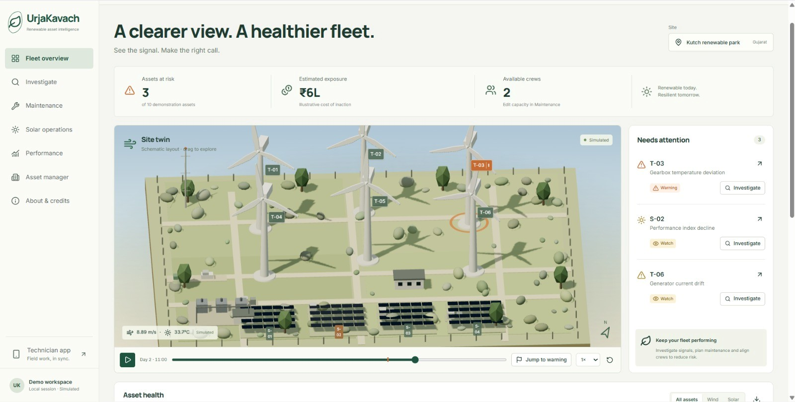
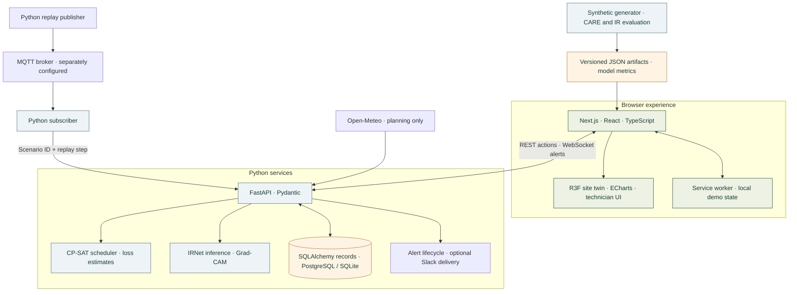
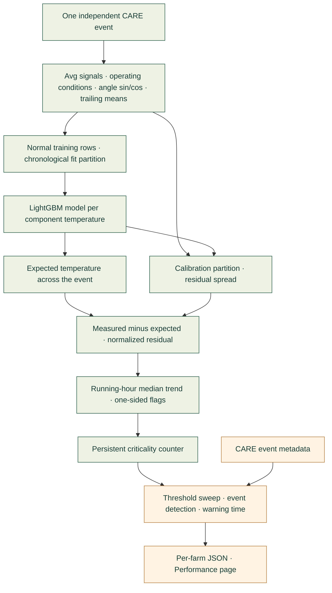
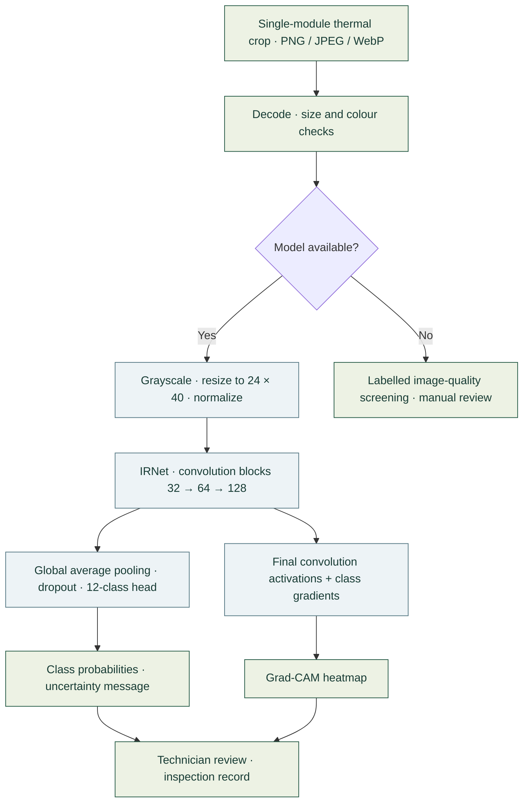
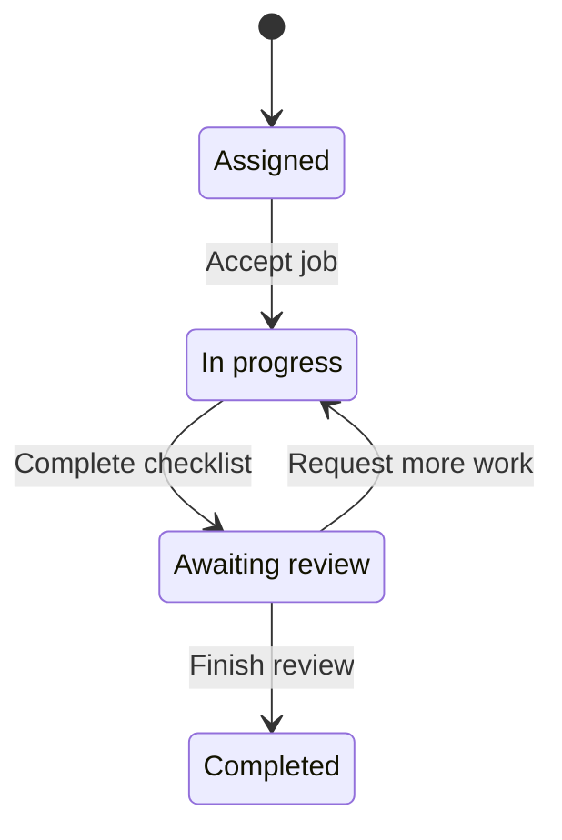
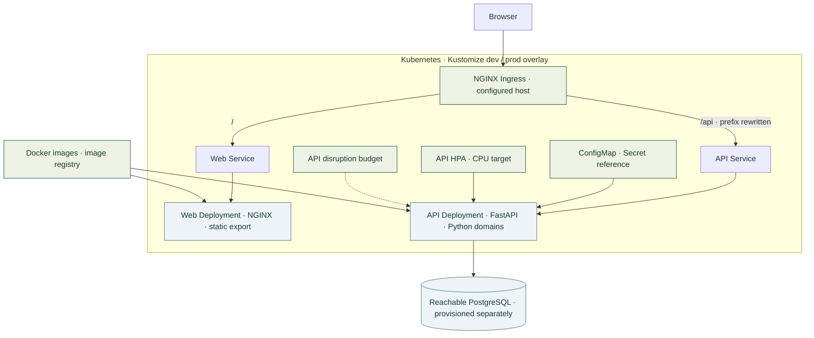

<div align="center">

# UrjaKavach

### Renewable asset intelligence

**Detect → Investigate → Prioritize → Act → Prove**

A digital operations twin for the people who keep wind and solar assets running.

[](https://nextjs.org/)
[](https://www.typescriptlang.org/)
[](https://www.python.org/)
[](services/ml/ir_classifier.py)
[](docker/README.md)
[](k8s/README.md)

[Product](#product) · [Architecture](#architecture) · [Results](#results-and-evidence) · [Quick start](#quick-start) · [Deployment](#deployment) · [Credits](#credits-and-licensing)

</div>



*The demonstration site is schematic. Operational telemetry, asset risk and financial exposure in these screenshots are labelled simulated or estimated.*

## Why UrjaKavach

Unplanned downtime costs renewable operators energy, revenue and scarce maintenance time. A warning is useful only when an operator can understand it, decide what deserves attention and give a technician a clear next action.

UrjaKavach connects those decisions in one workspace: explore a renewable site in 3D, investigate deviations against expected behaviour, compare repair schedules, inspect an infrared module image and review the evidence behind every claim. Built for **HackOut’26**, it combines a complete demonstration workflow with measured wind and infrared models, Python decision services, offline operation and containerized deployment.

| User | The decision we support |
|---|---|
| **Operator** | Which assets need attention, what changed, and which repair should happen first? |
| **Technician** | What is my next job, what evidence should I review, and what did the inspection find? |
| **Asset manager** | Where is exposure concentrated, how does maintenance change the estimate, and how strong is the evidence? |

## Product

| Step | Experience | What it connects |
|---|---|---|
| **Detect** | Interactive fleet twin, asset health table, attention list and replay controls | Asset identity, operating signals and warning state |
| **Investigate** | Measured-versus-expected charts, residuals, criticality, period comparison and nacelle cutaway | A visible deviation and the associated subsystem |
| **Prioritize** | Crew controls, repair delays, job locks, Gantt schedule and plan differences | Maintenance constraints and estimated cost of waiting |
| **Act** | Technician work orders, checklists, field notes and infrared inspection | An operator decision and a reviewable field record |
| **Prove** | Model results, per-farm outcomes, solver artifacts and explicit limitations | Product behaviour and its supporting evidence |

### Investigate with context


Synchronized charts connect the replay to a schematic subsystem view. The interface presents **“Signals most associated with this deviation”**; an association guides inspection and does not establish a root cause. The bundled investigation uses a synthetic Ridge scenario, while the real CARE LightGBM results are reported separately on the Performance page.

### Plan the right repair


The Python **OR-Tools CP-SAT** scheduler accounts for skills, working shifts, parts readiness, access windows, job locks and travel between wind and solar groups. Operators can adjust capacity and delay a repair, then inspect the changed assignments and unscheduled-job reasons. Offline mode selects an actual precomputed CP-SAT result; a connected API computes new plans.

<details>
<summary><strong>Explore solar operations, portfolio management and the technician workspace</strong></summary>

### Solar operations


An inverter heatmap, performance trends and cleaning economics help operators explore persistent underperformance. These operating series remain simulated; the trained infrared classifier is a separate, measured capability.

### Asset manager


Review risk concentration, maintenance readiness and estimated exposure. Estimated avoided loss is a scenario comparison, not realized savings.

### Technician workspace


Review assigned jobs, complete checklists, record findings and export field reports. With the API connected, infrared uploads return IRNet class probabilities and Grad-CAM when model loading succeeds. Offline mode supports local records and manual observations.

</details>

*Screenshots are selected from the supplied demo build. The implementation and model results below reflect the repository revision linked at the end of this README.*

## Technology stack

Python owns the data, models, API and decision logic; TypeScript owns the browser experience.

| Layer | Technologies | Role |
|---|---|---|
| Web application | **Next.js 16.3.5**, **React 19.2.8**, **TypeScript 5.9.3** | App Router, static export and responsive application screens |
| 3D visualization | **Three.js 0.186.0**, **React Three Fiber 9.7.0**, **drei 10.7.8** | Procedural site twin, turbines, solar rows and subsystem cutaway |
| Charts and interface | **Apache ECharts 6.1.0**, **Lucide**, plain CSS, **Inter / Manrope** | Dense time series, status indicators and shared design tokens |
| Browser state | **TanStack Query 5**, **Zustand 5**, Web App Manifest and service worker | Artifact queries, local workflow state and offline navigation |
| API | **Python 3.12**, **FastAPI 0.141.1**, **Pydantic 2**, **Uvicorn** | Validated REST endpoints, uploads and WebSocket transport |
| Persistence | **SQLAlchemy 2**, **PostgreSQL 16**, **psycopg2-binary**, SQLite | PostgreSQL in Compose; SQLite fallback for local API use |
| Wind modelling | **LightGBM 4.7.0**, **scikit-learn**, **NumPy**, **pandas**, **SciPy** | Temperature normal-behaviour models, preprocessing and residual analysis |
| Infrared modelling | **PyTorch 2.14.0**, **Pillow**, custom **IRNet** | CPU inference, 12-class thermal classification and Grad-CAM |
| Maintenance decisions | **OR-Tools 9.15 CP-SAT**, NumPy | Constrained scheduling, baseline comparisons and Monte Carlo loss bands |
| Integration | **paho-mqtt 2.1**, **HTTPX**, WebSockets, Slack incoming webhook | Replay ingestion, forecast requests, warning delivery and escalation |
| Containers | **Docker**, **Docker Compose**, **NGINX 1.27** | Multi-stage images, static web serving and local web/API/database stack |
| Orchestration | **Kubernetes (K8s)**, **Kustomize**, NGINX Ingress | Dev/prod overlays, Services, probes, HPA and disruption budget |
| Delivery and quality | **GitHub Actions**, **Playwright**, **pytest**, **ESLint**, **openapi-typescript**, **Vercel** | CI configuration, tests, API types and static web deployment |
| Observability | **Sentry Python SDK** | Optional API monitoring hook, enabled with a DSN |

Exact dependency pins are in [package-lock.json](package-lock.json) and [requirements.lock](requirements.lock). The infrared implementation uses **PyTorch**; TensorFlow/Keras and EnergyFaultDetector are not part of the current trained-model implementation. TimescaleDB and normalized telemetry migrations remain future work; current persistence uses a generic `demo_records` table.

## Architecture

### Application and data flow



**Two operating modes:** the web reads packaged artifacts and remains usable without an API; connecting the API enables live optimization, persisted work orders, image inference and alert transport. The browser does not automatically replace its simulated fleet with the CARE evaluation dataset. MQTT ingestion resolves a scenario and step to precomputed scores; live streaming M2 inference is not implemented.

### Wind modelling pipeline



Each event is trained independently because CARE timestamps are anonymized across files. Feature roles come from each farm's descriptions. Component temperatures and counters are excluded from predictors; trailing operating-condition means represent thermal inertia. See [normal_behavior.py](services/ml/normal_behavior.py), [care_loader.py](services/ml/care_loader.py) and [train_care_nbm.py](scripts/train_care_nbm.py).

### Infrared classification



The trained weights are committed at [artifacts/models/ir_classifier.pt](artifacts/models/ir_classifier.pt). The classifier expects grayscale thermal crops of individual modules, not full drone maps or arbitrary photographs. Its colour check is a heuristic input guard, not a general out-of-distribution detector. Grad-CAM visualizes model attention; it does not confirm a physical defect.

### Work-order lifecycle



The API validates transitions and requires a completed checklist before review or completion. Demo role switching changes the workspace view; it is not authentication.

## Results and evidence

### Wind: real CARE data, exploratory evaluation

At the published criticality threshold of **432**, the committed artifacts report:

| Farm | Anomaly events detected | Normal events with an alarm | Median warning before event end, among detections | Not assessable |
|---|---:|---:|---:|---:|
| A | 0 / 4 | 0 / 10 | — | 8 |
| B | 5 / 6 | 0 / 9 | 26.30 days | 0 |
| C | 9 / 27 | 4 / 31 | 11.67 days | 0 |
| **Total** | **14 / 37** | **4 / 50** | **No aggregate median published** | **8** |

Source: [published CARE evaluation](artifacts/demo_bundle/care-evaluation.json) and the per-event reports for [Farm A](artifacts/metrics/care_m2_wind_farm_a.json), [Farm B](artifacts/metrics/care_m2_wind_farm_b.json) and [Farm C](artifacts/metrics/care_m2_wind_farm_c.json).

These are project-specific measurements, not the official CARE score or its Coverage, Accuracy, Reliability and Earliness components. The 26.30-day figure belongs to **Farm B**, not the full fleet. The eight excluded events do not disappear from the evaluation: they have fewer than the required observable prediction rows.

**Evaluation boundary:** a chronological training/calibration split exists within each event, but the published operating point is selected from the reported event sweep. In the current [publication script](scripts/publish_care_evaluation.py), detection count participates in selection under a normal-event false-alarm budget. This is therefore exploratory evidence, not a frozen, independent event-level test result. The running-status filter also differs from the brief's official Farm A scoring convention. A clean dev/test protocol and official CARE scoring remain necessary before benchmark claims.

### Infrared: held-out image classification

The committed [IR evaluation artifact](artifacts/metrics/ir-classifier.json) reports a stratified 70/15/15 split, seed 0, validation-based model selection and a final test evaluation.

| Measure | Recorded result |
|---|---:|
| **Macro-F1** | **0.6075** |
| Multiclass accuracy | 75.19% |
| Anomaly-versus-normal recall | 96.1% |
| Anomaly-versus-normal precision | 85.0% |
| Training / validation / test images | 14,010 / 2,995 / 2,995 |
| Classes | 12 |

Class imbalance matters: half the dataset is `No-Anomaly`, and Soiling and Hot-Spot classes remain weaker. The split is stratified by image, not a verified site- or module-group split; these results do not establish cross-site generalization. Softmax confidence is not a calibrated probability of equipment failure.

Try the real held-out crops in [artifacts/ir_demo](artifacts/ir_demo/README.md), including the harder examples, through the connected technician inspection flow.

### Maintenance computation

The [demo manifest](artifacts/demo_bundle/manifest.json) records **384 CP-SAT cases**, a **median generation time of 8.39 ms** and a **maximum of 84.76 ms**. These are offline solver-generation measurements on synthetic jobs, not end-to-end cloud latency. The planner compares CP-SAT against a highest-risk-first policy and a fixed input-order “calendar” policy; the latter is not a longitudinal fixed-interval maintenance study.

### Evidence labels

| Label | Meaning |
|---|---|
| **Simulated** | Generated fleet telemetry, solar series, risk indices or demonstration jobs |
| **Measured** | Results read from a recorded model-evaluation artifact |
| **Estimate** | A calculation from explicit, editable planning assumptions |
| **Offline demo data** | Packaged artifacts and browser-local changes; no cross-device synchronization |
| **Precomputed plan** | A saved Python CP-SAT result for a supported demo configuration |

## Maintenance economics

The loss domain compares repairing now, delaying repair and taking no action over a chosen horizon. It uses shared Monte Carlo draws to make scenario comparisons internally consistent.

```text
Expected loss for delay d
  = P_fail(d) × (reactive downtime × daily energy × tariff + reactive repair cost)
  + (1 − P_fail(d)) × (planned-window energy × tariff + planned repair cost)
  + derating loss until repair

Expected daily energy (kWh)
  = rated capacity (MW) × 1,000 × 24 × capacity factor
```

Capacity, tariff, repair costs, downtime, derating and hazard assumptions are editable. **P10/P50/P90 describe uncertainty in those assumptions**; the current hazard is not calibrated on CARE, and the bands are not predictive confidence intervals. The current energy calculation uses capacity factor, not an empirical forecast power curve. See [loss.py](services/api/app/domain/loss.py).

## Quick start

### Full local stack with Docker Compose

```bash
git clone https://github.com/Jyotier2006/Urja_Kavach.git
cd Urja_Kavach
docker compose up --build -d
docker compose ps
```

| Service | Address |
|---|---|
| Web application | [localhost:8080](http://localhost:8080) |
| API documentation | [localhost:8000/docs](http://localhost:8000/docs) |
| Health endpoint | [localhost:8000/health](http://localhost:8000/health) |
| PostgreSQL | Internal Compose network, `db:5432` |

The Compose file runs the NGINX web image, Python API and PostgreSQL with a persistent database volume. Database port 5432 is not published to the host. The included credentials are local development defaults. View logs with `docker compose logs -f`; stop the stack with `docker compose down`.

### Web development without containers

Use **Node.js 24** and **Python 3.12**. From the repository root:

```bash
npm ci
npm run dev
```

Open [localhost:3000](http://localhost:3000). The bundled demo needs no API key.

```bash
npm run build
npm run start
```

The production build invokes `python3` to generate the offline service worker. On Windows, make `python3` available, or run `npx next build` inside `apps/web`, then run `py -3.12 scripts/build_offline.py` from the repository root. Offline navigation requires an initial successful load and service-worker installation; test it against the production export.

<details>
<summary><strong>Run the Python API separately</strong></summary>

```bash
python3.12 -m venv .venv
.venv/bin/python -m pip install -r requirements.lock
.venv/bin/uvicorn services.api.app.main:app --host 127.0.0.1 --port 8000
```

Windows:

```powershell
py -3.12 -m venv .venv
.venv\Scripts\python -m pip install -r requirements.lock
.venv\Scripts\python -m uvicorn services.api.app.main:app --host 127.0.0.1 --port 8000
```

Set `NEXT_PUBLIC_API_URL=http://127.0.0.1:8000` in `apps/web/.env.local` and restart the web dev server. For a static production export, rebuild after changing the API URL.

</details>

## Deployment

Docker and Kubernetes configuration is included in the repository. The deployment paths serve the same static frontend and Python API; they differ in infrastructure management.

| Path | Included implementation | Verification recorded in deployment docs |
|---|---|---|
| **Docker Compose** | Multi-stage API/web images, NGINX, PostgreSQL, health checks and persistent database volume | Both images built; full stack reported healthy |
| **Kubernetes / K8s** | Kustomize base, dev/prod overlays, Deployments, Services, Ingress, ConfigMap, Secret template, probes, resource limits, API HPA and PodDisruptionBudget | Overlays rendered and client-side validation reported; live-cluster rollout not yet verified |
| **Vercel** | Next.js static-export deployment settings | Web can be deployed independently; Python API is hosted separately |

### Kubernetes topology



The dev overlay uses one replica per Deployment and removes the HPA and disruption budget. The prod overlay starts with three replicas per Deployment; the API HPA allows two to eight replicas at a 70% CPU target. Manifests declare non-root execution, read-only root filesystems, dropped capabilities, resource bounds and health probes. These settings describe committed configuration, not a demonstrated availability guarantee.

Before applying an overlay, provide reachable PostgreSQL, real secrets, an ingress controller and the referenced images. Replace the host/origin settings and verify the active Kubernetes context. The prod overlay references GHCR tags that must be published separately; CI currently builds images without pushing them. When building the web image, use an **absolute browser-accessible API URL** (including `/api` under the supplied ingress) so REST and WebSocket URLs resolve correctly.

```bash
# Render the actual manifests.
kubectl kustomize k8s/overlays/dev
kubectl kustomize k8s/overlays/prod

# Validate using an appropriately configured kubectl context.
make k8s-validate

# After configuring images, database, secrets and ingress:
kubectl apply -k k8s/overlays/dev
kubectl get deployments,pods,services -n urjakavach-dev
kubectl rollout status deployment/urjakavach-api -n urjakavach-dev
```

The current API has no production authentication, and WebSocket connections, replay tasks and escalation timers are process-local. Multiple API replicas do not share those in-memory objects. A shared event channel, durable escalation worker and access control are required for reliable multi-replica public operation. PostgreSQL is not included in the K8s manifests. Full details: [Docker](docker/README.md), [Kubernetes](k8s/README.md), [deployment guide](docs/DEPLOYMENT.md).

### Vercel settings

| Setting | Value |
|---|---|
| Root Directory | Repository root |
| Framework Preset | `Other` |
| Install Command | `npm ci` |
| Build Command | `npm run build` |
| Output Directory | `apps/web/out` |
| `NEXT_PUBLIC_API_URL` | Unset for the bundled demo; backend HTTPS URL for connected actions |

`NEXT_PUBLIC_API_URL` is a **build-time** setting for both static hosting and the Docker web image. Changing a container runtime variable will not alter an already-built frontend. Python must be available to the build for `scripts/build_offline.py`.

### Configuration

| Variable | Used by | Purpose |
|---|---|---|
| `NEXT_PUBLIC_API_URL` | Web build | Public API origin; no secret values |
| `DATABASE_URL` | API | PostgreSQL connection; otherwise local SQLite |
| `CORS_ORIGINS` | API | Comma-separated permitted browser origins |
| `SLACK_WEBHOOK_URL` | API | Optional incoming-webhook delivery |
| `ALERT_ESCALATION_SECONDS` | API | Unacknowledged-warning delay; Compose/K8s set 900 seconds |
| `SENTRY_DSN` | API | Optional Sentry initialization |
| `API_URL` | MQTT subscriber | API address used for replay ingestion |
| `MQTT_HOST`, `MQTT_PORT` | MQTT subscriber | Broker connection |

## API and contracts

Interactive OpenAPI documentation is available at `/docs` when the API is running. The checked-in contract is [artifacts/openapi.json](artifacts/openapi.json), with TypeScript definitions in [api-schema.d.ts](apps/web/src/lib/api-schema.d.ts).

| Domain | Endpoints |
|---|---|
| Fleet | `GET /health`, `/sites`, `/assets`, `/assets/{id}` |
| Investigation | `GET /scenarios`, `/scenarios/{id}/telemetry`, `/scenarios/{id}/scores`, `/compare` |
| Alerts | `GET /alerts`, `POST /alerts/{id}/ack`, `GET /alerts/{id}/evidence` |
| Evidence | `GET /metrics/models`, `/metrics/solar`, `/metrics/ir` |
| Economics | `POST /loss/estimate`, `GET /assumptions`, `PUT /assumptions` |
| Planning | `POST /schedule/optimize`, `GET /schedules/{id}`, `GET /forecast` |
| Field work | `GET /workorders`, `POST /workorders`, `PATCH /workorders/{id}` |
| Solar / infrared | `GET /solar/inverters`, `/solar/performance`, `POST /solar/ir/classify` |
| Replay | `POST /replay/start`, `/replay/stop`, `/ingest/replay` |
| WebSockets | `/ws/telemetry`, `/ws/alerts` |

Telemetry supports LTTB downsampling. IR uploads accept PNG, JPEG or WebP with a 5 MB limit. Classification falls back explicitly to image-quality screening if the model cannot load. An endpoint's presence does not imply a completed empirical model: for example, unavailable M1/M3 scores are rejected rather than fabricated.

## Data and reproducibility

| Source | Use | Current state / attribution |
|---|---|---|
| [CARE To Compare v6](https://zenodo.org/records/15846963) | Real wind SCADA and event metadata for M2 | Acquisition and checksum verification recorded; raw data excluded from Git. **CC BY-SA 4.0** |
| [Raptor Maps Infrared Solar Modules](https://github.com/RaptorMaps/InfraredSolarModules) | 20,000 thermal crops across 12 classes for IRNet | Model weights, metrics and selected test crops included. **MIT**, retain upstream notices |
| [Solar Power Generation Data](https://www.kaggle.com/datasets/anikannal/solar-power-generation-data) | Intended Indian inverter/weather telemetry | Acquisition and real telemetry validation pending; verify dataset terms before use |
| [Open-Meteo](https://open-meteo.com/) | Forward access-window planning | Optional forecast API; never joined to anonymized historical SCADA |
| Project-generated data | Fleet replay, solar demonstration, schedules and loss scenarios | Labelled **Simulated** or **Estimate**; not benchmark observations |

CARE archive MD5: `2547b58c21ac8c242d13232860cf500c`. Each event remains an independent scenario. The downloader saves archives and integrity records; extraction is a separate step. See [dataset acquisition](docs/DATASETS.md).

<details>
<summary><strong>Reproduce model artifacts</strong></summary>

With dependencies installed and the relevant datasets extracted into the paths expected by the loaders:

```bash
.venv/bin/python scripts/train_care_nbm.py A
.venv/bin/python scripts/train_care_nbm.py B
.venv/bin/python scripts/train_care_nbm.py C
.venv/bin/python scripts/publish_care_evaluation.py

.venv/bin/python scripts/train_ir_classifier.py
.venv/bin/python scripts/publish_ir_evaluation.py
```

Rebuild the web export after publishing new artifacts. Keep model evaluation outputs separate from synthetic demo generation and check the manifest hashes when refreshing bundles. Training may take substantial time; the committed metrics can be inspected without downloading the raw datasets.

</details>

## Repository guide

| Path | Responsibility |
|---|---|
| [apps/web](apps/web) | Screens, 3D scenes, charts, browser state, PWA and Playwright tests |
| [services/api/app](services/api/app) | REST/WebSocket API, persistence, loss and infrared inspection |
| [services/ml](services/ml) | CARE loading, preprocessing, normal-behaviour models, criticality and IRNet |
| [services/optimizer](services/optimizer) | CP-SAT scheduling and comparison policies |
| [services/simulator](services/simulator) | MQTT publisher and ingestion subscriber |
| [services/alerts](services/alerts) | Alert integration notes; runnable logic currently lives in the API |
| [scripts](scripts) | Acquisition, training, artifact publishing, offline build and OpenAPI export |
| [artifacts](artifacts) | Demo bundles, metrics, model weights, sample IR crops and API contract |
| [docker](docker) / [docker-compose.yml](docker-compose.yml) | Container builds and local full-stack runtime |
| [k8s](k8s) | Kubernetes base resources and Kustomize overlays |
| [.github/workflows](.github/workflows) | CI jobs for code, browser, image and manifest checks |
| [docs](docs) / [tests](tests) | Design, decisions, deployment, traceability and Python verification |

## Quality and continuous integration

The [GitHub Actions workflow](.github/workflows/ci.yml) defines Python tests, type checking, linting, static export, browser journeys, Docker image builds and Kubernetes manifest validation. Image builds do not publish to a registry. See [Actions](https://github.com/Jyotier2006/Urja_Kavach/actions) for current run status; configured checks are not a claim of green CI.

```bash
.venv/bin/python -m pip install -r requirements-dev.lock   # in-process MQTT broker for the chain test
.venv/bin/python -m pytest services tests -q
npm run typecheck
npm run lint
npm run build
npx playwright install chromium
npm run test:e2e
```

Playwright covers the detect-to-evidence journey, phone-width layout and offline reload/navigation. Its [committed report](artifacts/metrics/browser-tests.json) records three passing tests. Python tests cover loss calculations, constraints, work-order validation, criticality and model behaviour.

Two integration paths are exercised rather than assumed. [test_mqtt_integration.py](tests/test_mqtt_integration.py) runs the whole ingestion chain — real publisher payload, real MQTT broker, real subscriber callback, real HTTP, a real API process — and asserts an alert at the far end, plus that a forged reading off the wire cannot inject telemetry. [test_alert_delivery.py](tests/test_alert_delivery.py) stands up a local HTTP receiver and asserts the outbound webhook payload, alongside the unconfigured, failing and unreachable cases. The broker is [amqtt](requirements-dev.lock), a test-only dependency that never reaches the API image; Slack itself is never contacted.

## Requirement coverage and next steps

| ID | Requirement | Current implementation |
|---|---|---|
| **R1** | Use sensor and inspection data | Synthetic operational signals; real CARE temperature modelling and real IR classification |
| **R2** | Detect early degradation | B0/Ridge demo, measured LightGBM M2, criticality and IRNet; official CARE evaluation pending |
| **R3** | Flag at-risk assets | Fleet health states, attention list, replay and alert center |
| **R4** | Prioritize maintenance | CP-SAT schedules with crew, skill, parts, shift and access constraints |
| **R5** | Estimate energy/revenue exposure | Editable Python loss model with Monte Carlo scenario bands |
| **R6** | Serve operators, technicians and managers | Dedicated responsive workspaces, checklists, inspection capture and portfolio view |
| **R7** | IoT integration and cloud alerting | MQTT source, replay ingestion, WebSocket alerts and optional Slack escalation, with the broker chain and webhook contract both covered by integration tests |

Next priorities are independent event-level CARE evaluation; M1/M3 and SHAP/ARCANA; real solar telemetry and fault-injection validation; stronger rare-class IR performance and a model card; production authentication, shared event delivery, durable escalation and cross-device synchronization. Delivery to a hosted broker or a real Slack workspace, live K8s rollout and cloud monitoring still require their own verification against those services.

## Credits and licensing

**Built by this project:** the product workflow and visual design, procedural 3D twin, investigation experience, data/feature pipeline, normal-behaviour modelling approach, IRNet training and inference integration, loss domain, scheduling formulation, technician workflow, offline artifact delivery and deployment configuration.

**Reused foundations:** Next.js, React, Three.js, React Three Fiber, drei, TanStack Query, Zustand, FastAPI, Pydantic, SQLAlchemy, LightGBM and openapi-typescript use MIT licensing; Lucide uses ISC; Apache ECharts, OR-Tools, TypeScript and Playwright use Apache-2.0; NumPy, pandas, scikit-learn and PyTorch use BSD-style licensing; Inter and Manrope use the SIL Open Font License. Preserve the notices distributed with each exact package version. These dependency licenses do not assign a license to this project's own code.

CARE citation: Gück, Roelofs and Faulstich, *CARE to Compare: A Real-World Benchmark Dataset for Early Fault Detection in Wind Turbine Data*, **Data 2024, 9(12), 138**, [doi:10.3390/data9120138](https://doi.org/10.3390/data9120138). Dataset version: [doi:10.5281/zenodo.15846963](https://doi.org/10.5281/zenodo.15846963). Published adaptations of CARE data must retain applicable **CC BY-SA 4.0** attribution and share-alike terms. Credit Raptor Maps and retain its MIT license with redistributed infrared crops.

No top-level project `LICENSE` is present in the reviewed revision. The maintainers should specify the project's code license before others assume reuse rights.

Contributions should follow [CONTRIBUTING.md](CONTRIBUTING.md). Keep changes focused, preserve artifact provenance, document consequential decisions and run the relevant checks. Never commit credentials or raw multi-gigabyte datasets.

---

<div align="center">

**UrjaKavach · Renewable today. Resilient tomorrow.**

Built for HackOut’26 · [Repository](https://github.com/Jyotier2006/Urja_Kavach) · [Engineering decisions](docs/DECISIONS.md) · [Deployment](docs/DEPLOYMENT.md)

</div>

<sub>Documentation reviewed against repository revision <a href="https://github.com/Jyotier2006/Urja_Kavach/commit/7b445a4f587825ad7a0717da566649b0e38d9b26">7b445a4</a>. Model numbers are quoted from committed artifacts; infrastructure status is taken from the deployment records, not a new training run or cluster rollout.</sub>
